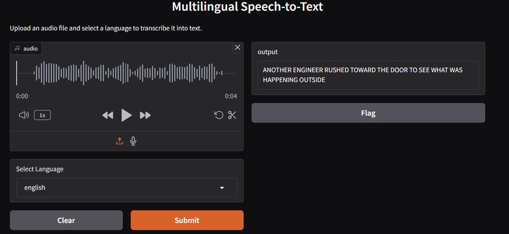

# 🎙️ Multilingual Speech-to-Text & Machine Translation

A deep learning-based multilingual Automatic Speech Recognition (ASR) system supporting **Hindi, English, Tamil, Telugu, and Malayalam** — with real-time transcription and English translation.

> Built as part of the Innovation Practice Laboratory (19I620) at PSG College of Technology.
## 🎛️ GUI Demo



---

## 🧠 What This Does

- Transcribes spoken audio in 5 Indian languages using state-of-the-art ASR models
- Translates transcribed text to English using **mBART**
- Identifies the input language automatically before transcription
- Runs through a clean **Gradio-based GUI** for real-time use
- Evaluated rigorously using **WER (Word Error Rate)** and **CER (Character Error Rate)**

---

## 🏗️ System Architecture

```
Audio Input
    │
    ▼
Language Identification
    │
    ├──► Wav2Vec2  (Hindi / English)
    └──► Whisper   (Tamil / Telugu / Malayalam)
         │
         ▼
   Transcribed Text
         │
         ▼
      mBART
         │
         ▼
   English Translation
```

---

## 🗂️ Repository Structure

```
SpeechToText/
│
├── models/
│   ├── EnglishSTT.py        # Wav2Vec2-based English ASR
│   ├── HindiSTT.py          # Wav2Vec2-based Hindi ASR
│   ├── TamilSTT.py          # Whisper fine-tuned for Tamil
│   ├── TeluguSTT.py         # Whisper fine-tuned for Telugu
│   └── MalayalamSTT.py      # Whisper fine-tuned for Malayalam
│
├── translation/
│   └── mbart_translate.py   # mBART translation to English
│
├── training/
│   └── fine_tune_whisper.py # Fine-tuning script with hyperparameters
│
├── evaluation/
│   └── compute_metrics.py   # WER / CER computation
│
├── GUI.py                   # Gradio UI — main entry point
├── requirements.txt
└── README.md
```

---

## ⚙️ Models Used

| Language   | ASR Model           | Dataset                        |
|------------|---------------------|--------------------------------|
| English    | Wav2Vec2            | LibriSpeech                    |
| Hindi      | Wav2Vec2            | Mozilla Common Voice           |
| Tamil      | Whisper (fine-tuned)| Mozilla Common Voice           |
| Telugu     | Whisper (fine-tuned)| Mozilla Common Voice           |
| Malayalam  | Whisper (fine-tuned)| Mozilla Common Voice           |

**Translation:** `facebook/mbart-large-50-many-to-one-mmt`

---

## 🔧 Training Hyperparameters

| Parameter                  | Value     |
|----------------------------|-----------|
| Batch Size (Train & Eval)  | 4         |
| Gradient Accumulation Steps| 2         |
| Epochs                     | 5         |
| Learning Rate              | 1e-5      |
| Warmup Steps               | 50        |
| Max Training Steps         | 100       |
| Evaluation Strategy        | Steps (every 25) |
| Mixed Precision (FP16)     | ✅ Enabled |

---

## 📊 Evaluation Metrics

**Word Error Rate (WER):**

$$WER = \frac{S + D + I}{N}$$

Where S = Substitutions, D = Deletions, I = Insertions, N = Total words in reference.

**Character Error Rate (CER):** Same formula at character level — more useful for morphologically complex scripts.

The model was evaluated on held-out speech recordings across all 5 languages, including noisy conditions using SNR-based metrics.

---
## 📈 WER Results

### English


### Tamil


### Telugu


### WER Formula


## 🚀 Getting Started

### 1. Clone the repo
```bash
git clone https://github.com/KingmakerKou/SpeechToText.git
cd SpeechToText
```

### 2. Install dependencies
```bash
pip install -r requirements.txt
```

### 3. Run the Gradio UI
```bash
python GUI.py
```

A local URL will appear in your terminal — open it in your browser to start transcribing.

---

## 📦 Requirements

```
torch
transformers
torchaudio
gradio
librosa
datasets
jiwer           # for WER/CER computation
sentencepiece   # for mBART tokenizer
```

> **Hardware:** NVIDIA CUDA-enabled GPU recommended (RTX 3060 or higher). Runs on CPU but slower.

---

## 🔍 Key Challenges Tackled

- **Low-resource languages** — Tamil, Telugu, Malayalam have limited training data; addressed via fine-tuning on Mozilla Common Voice
- **Code-switching** — handled through language identification before model routing
- **Noisy environments** — noise-robust training via diverse audio samples
- **Real-time latency** — optimized pipeline for near-instant transcription

---

## 🔮 Future Work

- Expand to more Indian languages (Bengali, Kannada, Odia)
- Deploy as a mobile/web app
- Improve context-awareness for domain-specific vocabulary
- Implement streaming transcription (word-by-word output)

---

## 👨‍💻 Team

| Name              | Roll No |
|-------------------|---------|
| Govarthanestan P  | 22I219  |
| Kamalesh M        | 22I228  |
| Koushik M         | 22I231  |
| Lokeshwaran G     | 22I232  |
| Soundar Raj M     | 22I261  |

**Faculty Guide:** Dr. T. Vairam, Assistant Professor (Sl.Gr.), Dept. of IT, PSG College of Technology

---

## 📄 License

This project is for academic purposes under PSG College of Technology's Innovation Practice Laboratory course.
